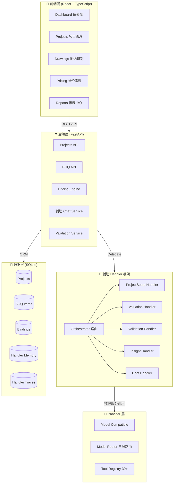

# 🏗️ 筑衡 — 全过程工程造价协同管控平台

[](LICENSE)
[](https://www.python.org/)
[](https://www.typescriptlang.org/)
[](https://fastapi.tiangolo.com/)
[](https://react.dev/)

> 🤖 **辅助驱动的建筑造价全流程管理平台**  
> 从图纸识别到清单生成、定额绑定、单价分析、成本核算的辅助化闭环解决方案

## 📋 项目概览

| 模块 | 功能 | 技术栈 |
|------|------|--------|
| **前端** | React + TypeScript + Ant Design | Vite, TailwindCSS, Material Symbols |
| **后端** | FastAPI + SQLAlchemy | Python 3.12, SQLite, Pydantic |
| **辅助** | 多 Handler 框架 | Model Compatible, 三层模型路由, 自研 Handler Framework |
| **数据** | 结构化造价数据 | BOQ 清单、定额库、材料价格 |

## ✨ 核心特性

<table>
<tr>
<td width="50%">

### 📐 图纸辅助识别

- 🎯 **辅助识别**：上传结构平面图，辅助 自动识别柱、梁、墙、板等构件
- 📊 **可视化标注**：边界框 + 置信度实时显示
- 🛠️ **手动调整**：修正/新增/删除/合并构件
- 📤 **一键导出**：识别结果直接生成 BOQ 清单

### 💰 计价管理

- 🔍 **单价分析**：人工/材料/机械费用完整分解
- 🔗 **定额绑定**：辅助匹配 + 系数调整
- 💹 **实时价格**：市场价动态查询
- 📈 **可视化**：成本构成图表展示

### 📈 报表中心

- 📊 **项目总览**：造价汇总 + 进度追踪
- ✅ **绑定进度**：清单项绑定完成度
- ⚠️ **异常报告**：辅助审核问题汇总
- 📉 **历史对比**：成本趋势分析

</td>
<td width="50%">

### 📊 清单管理

- ✏️ **CRUD 操作**：项目级 BOQ 清单完整管理
- 📥 **批量导入**：支持 Excel 快速导入
- 🔗 **定额绑定**：清单项关联定额库
- 🤖 **辅助匹配**：辅助推荐最佳定额

### 🤖 辅助 Handler 框架

- 🧠 **Orchestrator**：辅助意图路由 + 多 Handler 编排
- 🧩 **12+ 专业 Handler**：估价、校验、分析、批量审核等
- 🛠️ **30+ 工具**：定额搜索、绑定、计算、批量操作
- 🔌 **三层模型路由**：fast / balanced / powerful 自动选模型
- 💬 **上下文记忆**：跨会话 Memory + Extension 知识库
- ⚡ **性能优化**：批量工具调用、只读缓存、prompt 压缩

### ⚙️ 系统配置

- 📐 **费率规则**：管理费、利润、税金配置
- 🔑 **模型配置**：Provider、API Key、模型选择
- 💰 **价格库**：材料价格维护与更新
- 👥 **权限管理**：用户角色与访问控制

</td>
</tr>
</table>

## 🏗️ 技术架构



### 技术栈详情

| 层级 | 技术选型 | 说明 |
|------|---------|------|
| **前端框架** | React 19 + TypeScript | 类型安全的组件化开发 |
| **UI 库** | Ant Design 6 | 企业级组件 |
| **状态管理** | React Hooks | 轻量级状态管理 |
| **构建工具** | Vite 7 | 极速开发体验 |
| **后端框架** | FastAPI | 高性能异步 API |
| **ORM** | SQLAlchemy | 类型安全的数据库操作 |
| **数据库** | SQLite | 轻量级嵌入式数据库 |
| **辅助 框架** | 自研 Handler Framework | BaseHandler + Orchestrator + Tool Registry |
| **API 文档** | OpenAPI (Swagger) | 自动生成交互式文档 |

## 📦 项目结构

```
building cost/
├── frontend/                    # React 前端
│   ├── src/
│   │   ├── pages/             # 页面组件 (10+)
│   │   ├── components/        # 通用组件 (15+)
│   │   ├── api.ts             # API 接口定义
│   │   └── index.css          # 全局样式
│   └── package.json
├── backend/                     # FastAPI 后端
│   ├── app/
│   │   ├── api/routes/        # API 路由 (15+ 模块)
│   │   ├── models/            # 数据模型 (10+)
│   │   ├── services/          # 业务逻辑
│   │   └── assistant/
│   │       ├── agents/v2/     # Handler v2 (12+ Handlers)
│   │       ├── framework/     # Handler Framework 核心
│   │       │   ├── base_handler.py       # 抽象基类 + 推理循环
│   │       │   ├── model_switcher.py     # 三层模型路由
│   │       │   ├── log_collector.py   # 可观测性
│   │       │   ├── context_store.py      # 跨会话记忆
│   │       │   └── stream_executor.py# 流式工具执行
│   │       ├── providers/     # 推理服务 Provider 适配
│   │       ├── tools/         # 工具定义 (30+)
│   │       ├── skills/        # 领域知识库
│   │       └── pipelines/     # 多 Handler 流水线
│   ├── tests/                 # 测试 (5,600+ 行)
│   └── requirements.txt
├── docs/design/                 # 架构设计文档
└── README.md
```

## 🚀 快速开始

### 📋 环境要求

| 工具 | 版本要求 | 说明 |
|------|---------|------|
| Python | 3.12+ | 后端运行环境 |
| Node.js | 18+ | 前端构建工具 |
| Git | 最新版 | 版本控制 |
| 操作系统 | macOS / Linux / Windows | 跨平台支持 |

### ⚡ 一键启动（推荐）

```bash
# Windows 可直接双击 start_dev.bat，或手动启动：

# 1. 启动后端（新终端）
cd backend
python -m venv venv
venv\Scripts\python.exe -m pip install -r requirements.txt
venv\Scripts\python.exe -m uvicorn app.main:app --reload --host 0.0.0.0 --port 8098

# 2. 启动前端（新终端）
cd frontend
npm install
npm run dev
```

### 🌐 访问应用

| 服务 | 地址 | 说明 |
|------|------|------|
| 🎨 **前端应用** | http://localhost:5173/zjcost/ | React 用户界面 |
| ⚙️ **后端 API** | http://localhost:8098 | FastAPI 服务 |
| 📚 **API 文档** | http://localhost:8098/docs | Swagger UI |
| 🔧 **ReDoc** | http://localhost:8098/redoc | 备用文档 |

### 🤖 配置 辅助（可选）

1. 复制环境变量模板：
```bash
cp .env.example .env
```

2. 编辑 `.env` 文件：
```env
# 在线推理服务配置
ZH_PROVIDER=compatible
ZH_API_KEY=sk-your-api-key-here
ZH_BASE_URL=https://api.example.com/v1
ZH_MODEL=standard-model

# 或使用兼容的本地模型
ZH_PROVIDER=compatible
ZH_BASE_URL=http://localhost:11434/v1
ZH_MODEL=local-model

# OPT-4: 三层模型路由（可选）
ZH_MODEL_FAST=fast-model          # Tier 1: 简单查询
# ZH_MODEL 默认为 Tier 2: 标准分析
ZH_MODEL_POWERFUL=powerful-model   # Tier 3: 复杂推理
```

3. 重启后端服务即可生效

### 🧪 运行测试

```bash
cd backend
venv\Scripts\python.exe -m pytest tests
```

如果虚拟环境来自其他电脑或旧用户目录，请先重新创建：

```bash
python -m venv venv
venv\Scripts\python.exe -m pip install -r requirements.txt
```

### 🔐 安全配置

- `ZJCOST_AUTH_REQUIRED=false` 适合本地演示；部署或共享网络访问前请设为 `true`。
- `JWT_SECRET_KEY` 部署前必须改为随机长密钥。
- `BACKEND_CORS_ORIGINS` 只填写允许访问后端的前端地址。
- `MAX_UPLOAD_SIZE` / `DRAWING_MAX_UPLOAD_MB` / `IFC_MAX_UPLOAD_MB` 控制上传文件大小上限。
- `ZJCOST_ALLOW_REGISTRATION=false` 控制是否开放公开注册（默认关闭）。
 
## 📊 项目规模

### 代码统计

```
📦 总计约 60,000 行代码 (239 文件)
├── 🐍 Python (203 files)    35,126 行  (后端 + 辅助 Handler 框架 + 测试)
├── 📘 TypeScript/TSX (36)   13,402 行  (前端组件 + API)
├── 🎨 CSS                    9,290 行  (样式系统)
├── 📖 Markdown               2,533 行  (文档 + Extensions)
└── 🗄️ SQL                      121 行  (迁移脚本)
```

### 模块分布

| 模块 | 文件数 | 核心功能 |
|------|--------|----------|
| **后端 API** | 35+ | 路由 (15 模块)、服务、Schema |
| **前端页面** | 36 | Dashboard、项目、计价、图纸、知识图谱、辅助指挥中心 |
| **辅助 Handler v2** | 12+ | Orchestrator + 专业 Handler (估价/校验/分析/开项) |
| **Handler Framework** | 15+ | BaseHandler、ModelSwitcher、LogCollector、PluginRegistry |
| **辅助 工具** | 30+ | 定额搜索、绑定、计算、批量审核、报告生成 |
| **数据模型** | 10+ | SQLAlchemy ORM (含 Memory、Trace) |
| **测试** | 5,677 行 | Handler Framework 全覆盖 |

### 功能覆盖

- ✅ 10+ 主要页面（Dashboard、项目、计价、图纸、报表、知识图谱、辅助指挥中心等）
- ✅ 50+ REST API 端点
- ✅ 15+ 数据库表（含 Handler Memory、Trace）
- ✅ 12+ 辅助 Handler（Orchestrator 辅助路由）
- ✅ 30+ Handler 工具（含批量工具调用）
- ✅ 三层模型路由 (fast / balanced / powerful)
- ✅ 响应式设计（桌面 + 平板）

## 🧪 开发指南

### 添加新页面
1. 在 `frontend/src/pages/` 创建组件
2. 在 `App.tsx` 添加路由
3. 在 `NAV_ITEMS` 添加导航项
4. 编写 CSS 样式（遵循 `dr-` 前缀规范）

### API 开发
1. 在 `backend/app/models/` 定义数据模型
2. 在 `backend/app/api/routes/` 添加路由
3. 在 `backend/app/services/` 实现业务逻辑
4. 更新 `frontend/src/api.ts` 接口定义

### 辅助 Handler 开发

1. **新建 Handler**：继承 `BaseHandler`，定义 `name`、`system_prompt`、`tool_names`
2. **新建工具**：用 `@plugin_def` 装饰器注册到 PluginRegistry
3. **注册到 Orchestrator**：在 `orchestrator.py` 添加 delegate 路由
4. **模型路由**：在 `model_switcher.py` 的 `_AGENT_TIER_MAP` 配置 tier

```python
# 示例：创建新 Handler
class MyHandler(BaseHandler):
    name = "my_agent"
    description = "专业XX分析 Handler"
    system_prompt = "你是一位专业的..."
    tool_names = ["search_quotas", "calculate"]
```
